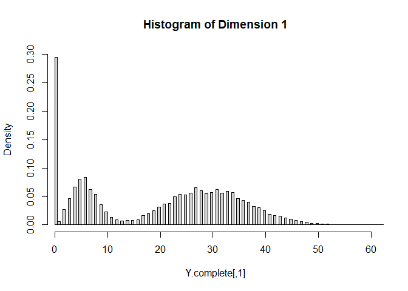
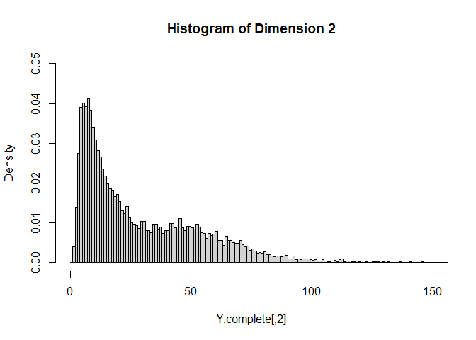

Introduction
------------

This document contains the data generation process for the dataset
`LRMoEDemoData` included in the `LRMoE` package. This also serves as an
example of using the `SimYSet` function included in the package.

Data Simulation
---------------

### Complete Dataset

Supose there is an auto-insurance company with two lines of business,
with a total of 10,000 policies. The policyholder information includes
sex (1 for Male and 0 for Female), driver’s age (with range 20~80), car
age (with range 0~10), and region (1 for urban and 0 for rural). We
assume all covariates are uniformly and independently drawn at random.

    set.seed(7777) 
    sample.size = 10000
    intercept = rep(1, sample.size)
    sex = rbinom(sample.size, 1, 0.5)
    aged = runif(sample.size, 20, 80)
    agec = runif(sample.size, 0, 10)
    region = rbinom(sample.size, 1, 0.5)

    X = matrix(data = c(intercept, sex, aged, agec, region),
               nrow = sample.size, byrow = FALSE,
               dimnames = list(NULL,
                      c("intercept", "sex", "agedriver", "agecar", "region")))

For simplicity, we assume there are two latent risk classes: low (L) and
high (H). The characteristics for the high-risk class are male, young
age, old car age and urban region. This is specified by the following
matrix of logit regression coefficients, where the second row represents
the reference class.

    n.comp = 2
    alpha = matrix( c(-0.5, 1, -0.05, 0.10, 1.25,
                      0, 0, 0, 0, 0),
                    nrow = n.comp, byrow = TRUE)

We consider a two-dimensional response: claim frequency from the first
business line, and claim severity from the second business line. For
demonstration purposes and for simplicity, we don’t consider the same
business line to avoid the complication where zero frequency necessarily
implies zero severity. The component distributions and their parameters
are specified as follows.

    dim.m = 2
    comp.dist = matrix(c("poisson", "ZI-gammacount",
                         "lnorm", "invgauss"),
                       nrow = dim.m, byrow = TRUE)

    zero.prob = matrix(c(0, 0.2,
                         0, 0),
                       nrow = dim.m, byrow = TRUE)

    params.list = list( list(c(6), c(30, 0.5)),
                        list(c(4, 0.3), c(20, 20))
                      )

The `LRMoE` package includes a simulator. Given the covariates and
parameters defined above, we can directly simulate a dataset.

    Y.complete = LRMoE::SimYSet(X, alpha, comp.dist, zero.prob, params.list)

The simulated values are plotted as follows. For each dimension of `Y`,
the histogram is relatively well separated as two components. This is
more or less done on purpose to demonstrate that the fitting procedure
can identify the *true* model when it is known. In practice, we are
usually less concerned of the underlying data generating distribution,
as long as the LRMoE model provides a reasonable fit of data.

### Truncation and Censoring

One distinct feature of `LRMoE` is dealing with data truncation and
censoring, which is common in insurance contexts. Consequently, instead
of one single number for each dimension `d`, a tuple
`(tl.d, yl.d, yu.d, tu.d)` is required, where `tl.d`/`tu.d` are the
lower/upper bounds of truncation, and `yl.d`/`yu.d` are the lower/upper
bounds of censoring.

For illustration purposes, we assume the dataset is subject to the
following truncation and censoring.

<table>
<thead>
<tr class="header">
<th>Index</th>
<th><code>Y.complete[,1]</code></th>
<th><code>Y.complete[,2]</code></th>
</tr>
</thead>
<tbody>
<tr class="odd">
<td>1-6000</td>
<td>No truncation or censoring</td>
<td>No truncation or censoring</td>
</tr>
<tr class="even">
<td>6001-8000</td>
<td>No truncation or censoring</td>
<td>Left Truncated at 5</td>
</tr>
<tr class="odd">
<td>8001-10000</td>
<td>No truncation or censoring</td>
<td>Right Censored at 100</td>
</tr>
</tbody>
</table>

    # First block: 1~6000
    X.obs = X[1:6000,]

    tl.1 = rep(0, 6000)
    yl.1 = Y.complete[1:6000, 1]
    yu.1 = Y.complete[1:6000, 1]
    tu.1 = rep(Inf, 6000) 

    tl.2 = rep(0, 6000)
    yl.2 = Y.complete[1:6000, 2]
    yu.2 = Y.complete[1:6000, 2]
    tu.2 = rep(Inf, 6000) 

    # Second block: 6001~8000
    keep.idx = Y.complete[6001:8000,2] >= 5
    keep.length = sum(keep.idx)

    X.obs = rbind(X.obs, X[6001:8000,][keep.idx,])

    tl.1 = c(tl.1, rep(0, keep.length))
    yl.1 = c(yl.1, Y.complete[6001:8000, 1][keep.idx])
    yu.1 = c(yu.1, Y.complete[6001:8000, 1][keep.idx])
    tu.1 = c(tu.1, rep(Inf, keep.length))

    y.temp = Y.complete[6001:8000, 2][keep.idx]
    tl.2 = c(tl.2, rep(5, keep.length))
    yl.2 = c(yl.2, Y.complete[6001:8000, 2][keep.idx])
    yu.2 = c(yu.2, Y.complete[6001:8000, 2][keep.idx])
    tu.2 = c(tu.2, rep(Inf, keep.length))

    # Third block: 8001~10000
    X.obs = rbind(X.obs, X[8001:10000,])

    tl.1 = c(tl.1, rep(0, 2000))
    yl.1 = c(yl.1, Y.complete[8001:10000, 1])
    yu.1 = c(yu.1, Y.complete[8001:10000, 1])
    tu.1 = c(tu.1, rep(Inf, 2000))

    y.temp = Y.complete[8001:10000, 2]
    censor.idx = which(y.temp>=100)
    yl.temp = y.temp
    yl.temp[censor.idx] = 100
    yu.temp = y.temp
    yu.temp[censor.idx] = Inf
    tl.2 = c(tl.2, rep(0, 2000))
    yl.2 = c(yl.2, yl.temp)
    yu.2 = c(yu.2, yu.temp)
    tu.2 = c(tu.2, rep(Inf, 2000))

    # Put things together
    Y.obs = matrix(c(tl.1, yl.1, yu.1, tu.1, tl.2, yl.2, yu.2, tu.2),
              ncol = 8, byrow = FALSE,
              dimnames = list(NULL,
                      c("tl.1", "yl.1", "yu.1", "tu.1", 
                        "tl.2", "yl.2", "yu.2", "tu.2")))

As a result of truncating `Y.complete[,2]`, 172 rows are discarded,
leaving 9828 observations available for model fitting. Sample data
points are show below.

    # No truncation, no censoring
    Y.obs[1,]

    ##      tl.1      yl.1      yu.1      tu.1      tl.2      yl.2      yu.2      tu.2 
    ##  0.000000 27.000000 27.000000       Inf  0.000000  8.145064  8.145064       Inf

    # Y.2 is left-truncated
    Y.obs[6002,]

    ##     tl.1     yl.1     yu.1     tu.1     tl.2     yl.2     yu.2     tu.2 
    ##  0.00000  4.00000  4.00000      Inf  5.00000 62.02375 62.02375      Inf

    # Y.2 is right-censored
    Y.obs[7884,]

    ##      tl.1      yl.1      yu.1      tu.1      tl.2      yl.2      yu.2      tu.2 
    ##  0.000000 28.000000 28.000000       Inf  0.000000  5.887506  5.887506       Inf

We will export both the complete and incomplete datasets to the `LRMoE`
package.

    Y = matrix(c(rep(0,10000), Y.complete[,1], Y.complete[,1], rep(Inf,10000), 
                 rep(0,10000), Y.complete[,2], Y.complete[,2], rep(Inf,10000)),
              ncol = 8, byrow = FALSE,
              dimnames = list(NULL,
                      c("tl.1", "yl.1", "yu.1", "tu.1", 
                        "tl.2", "yl.2", "yu.2", "tu.2")))

    save(X, Y, X.obs, Y.obs, file = "LRMoEDemoData.RData")
